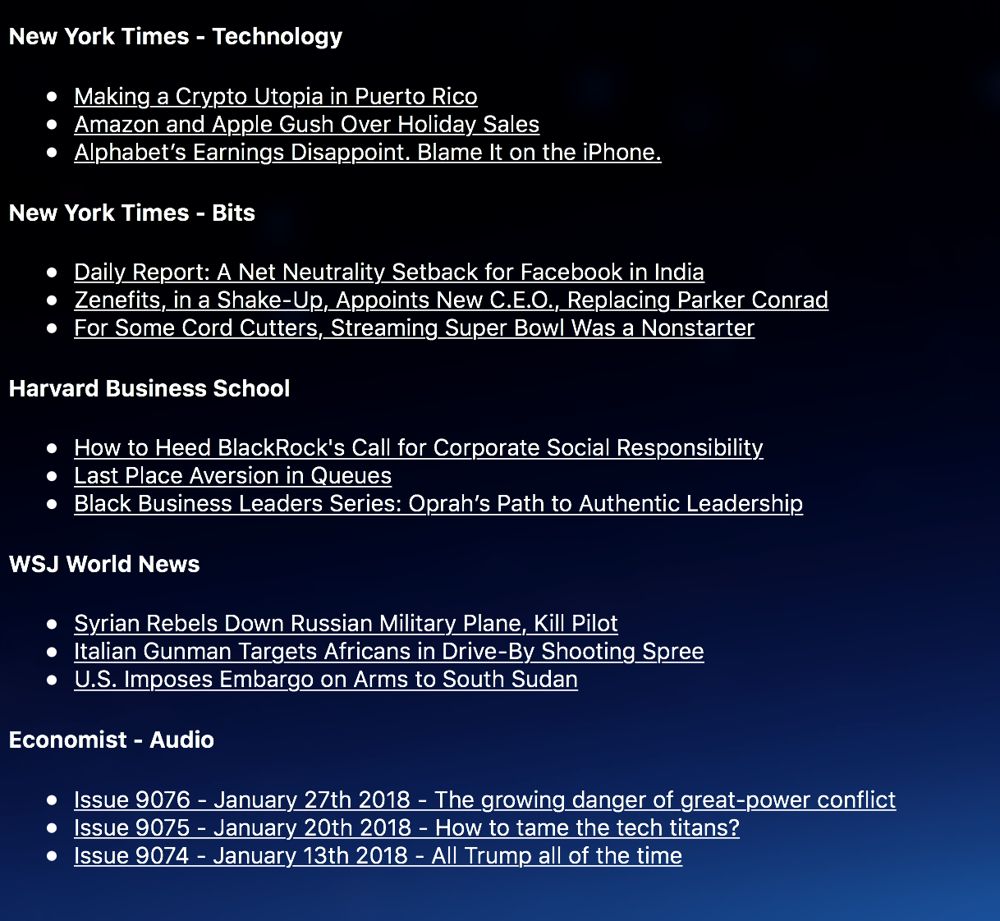

# gofeedme

A go RSS feed parser, rendered in simple HTML.

Set the name and URL of your RSS feeds in `config.json`, and run `go run main.go`.

Intended for use with [Übersicht](http://tracesof.net/uebersicht/), but spits out very basic HTML.

Inspired by the Übersicht [RSSs-Widget](http://tracesof.net/uebersicht-widgets/#RSSs_Ubersicht_Widget).
